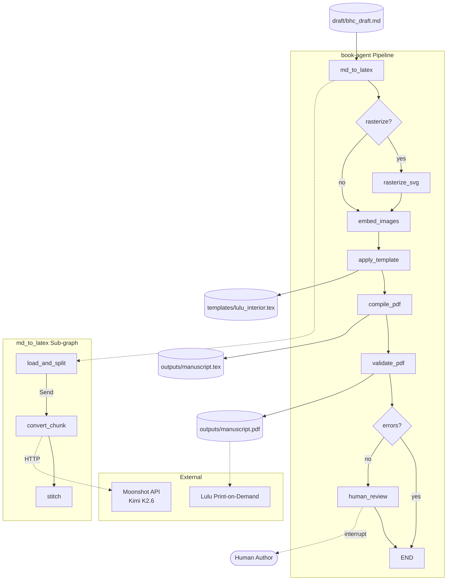

# book-agent

LangGraph pipeline that turns a Markdown book draft into a Lulu-compliant PDF.

Pipeline: markdown draft → LaTeX → rasterize SVGs → embed images → apply Lulu template → compile PDF → validate → human review.

## Setup

```bash
pip install -e .
```

Set your API key:

```bash
$env:MOONSHOT_API_KEY = "your-key-here"
```

## Configure the LLM

Copy the example and edit:

```bash
cp config/model_config_example.yaml config/model_config.yaml
```

`config/model_config.yaml` is gitignored — it may contain secrets.

```yaml
provider: openai
model: kimi-k2-6
base_url: https://api.moonshot.cn/v1
api_key_env: MOONSHOT_API_KEY
temperature: 0.0
```

Swap `provider`, `model`, and `base_url` freely. `get_llm()` in `config/__init__.py` instantiates whatever you specify.

## Run

```python
from graph import graph
from state import BookState
from langgraph.checkpoint.memory import MemorySaver

checkpointer = MemorySaver()
app = graph.compile(checkpointer=checkpointer)

initial_state: BookState = {
    "draft_path": "draft/bhc_draft.md",
    "glossary_path": "draft/bhc_glossary.md",
    "references_path": "draft/bhc_references.bib",
    "latex_content": "",
    "image_map": {},
    "svg_map": {},
    "pdf_path": None,
    "errors": [],
    "approved": False,
}

config = {"configurable": {"thread_id": "book-run-1"}}
result = app.invoke(initial_state, config=config)
```

## Why no `draft/` or `assets/` in the repo?

Both directories are gitignored because they contain per-book content that does not belong in version control. Create them locally:

```bash
mkdir draft assets assets/images assets/svg

# example draft structure
cat > draft/bhc_draft.md << 'EOF'
# Your Book Title

## Chapter 1

Your content here.
EOF

cp your_figure.png assets/images/fig1-1.png
cp your_diagram.svg assets/svg/fig1-1.svg
```

## Architecture



## Structure

- `draft/` — source manuscript, glossary, BibTeX references (gitignored, create locally)
- `assets/` — raster images and SVG diagrams (gitignored, create locally)
- `nodes/` — LangGraph node functions
- `config/` — model config, image policy, run config
- `templates/` — LaTeX template with Lulu geometry
- `outputs/` — generated `.tex` and `.pdf` (gitignored)